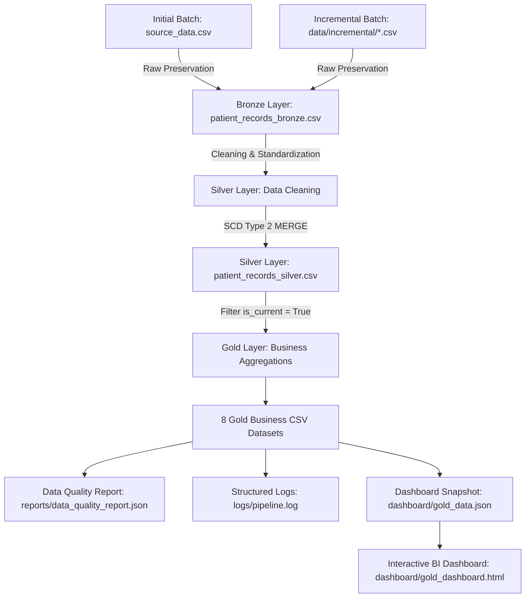

# Healthcare Data Pipeline (Medallion Architecture)

An enterprise-grade, reproducible data engineering pipeline built using **Medallion Architecture** (Bronze → Silver → Gold) to process patient encounter data, enforce data quality standards, track historical changes via **SCD Type 2 (Slowly Changing Dimensions)**, support incremental batch ingestion, and deliver data-driven BI dashboard insights.



---

## Executive Summary & Key Upgrades

Healthcare systems require robust data pipelines capable of handling operational updates, incremental file arrivals, negative billing entries, and data auditability.

### Production-Readiness Upgrades
1. **Incremental Batch Ingestion**: Supports initial full load (`data/source_data.csv`) followed by incremental delta batches (`data/incremental/*.csv`).
2. **Deterministic SCD Type 2 MERGE**: Preserves complete historical versioning. When an existing encounter's tracked attributes change, the previous version is expired (`is_current = False`, `effective_end_date = load_date`), and a new current version is inserted (`is_current = True`, `effective_start_date = load_date`).
3. **Automated Data Quality Reporting**: Generates `reports/data_quality_report.json` with measurable metrics (row counts, duplicates, nulls, invalid billings, SCD2 constraint validation, overall PASS/FAIL status).
4. **Structured Logging**: Replaced print statements with Python's standard `logging` module writing formatted audit events to `logs/pipeline.log` and console.
5. **Data-Driven Dashboard & Pipeline Status**: `dashboard/gold_dashboard.html` features a **Pipeline Status & Data Lineage** banner dynamically populated from `dashboard/gold_data.json`.

---

## Current Implementation vs. Databricks Production Target

| Area | Current Local Implementation (`src/`) | Databricks Target Implementation (`databricks/`) |
| :--- | :--- | :--- |
| **Execution Engine** | Python 3.11/3.14 + Pandas DataFrames | PySpark DataFrames + Spark SQL |
| **Storage Layer** | CSV files + `reports/data_quality_report.json` | Delta Lake ACID tables (`healthcare_bronze`, `healthcare_silver`, `healthcare_gold_*`) |
| **SCD Type 2** | Vectorized Pandas `scd2_merge()` algorithm | Delta Lake `DeltaTable.merge()` & DLT `dlt.apply_changes()` |
| **Orchestration** | `python src/pipeline.py` | Databricks Workflows / Delta Live Tables (DLT) declarative pipelines (`databricks/dlt_pipeline.py`) |
| **Data Quality** | `src/utils.py` fail-fast assertions + JSON report | DLT expectations (`@dlt.expect_or_drop`) |

---

## SCD Type 2 History Demonstration

When an encounter record changes (e.g. billing correction or updated lab results):

```
INITIAL VERSION (Day 1 - 2024-06-01):
encounter_key: 8f9a2b... | Name: Bobby Jackson | Billing: $18,856.28 | Test: Normal
is_current: False | effective_start_date: 2024-06-01 | effective_end_date: 2026-08-09 | surrogate_key: 101

UPDATED VERSION (Day 2 - 2026-08-09):
encounter_key: 8f9a2b... | Name: Bobby Jackson | Billing: $19,500.00 | Test: Abnormal
is_current: True  | effective_start_date: 2026-08-09 | effective_end_date: None     | surrogate_key: 50251
```

---

## Data Quality Report Schema (`reports/data_quality_report.json`)

```json
{
  "timestamp": "2026-08-08T18:41:04.941476+00:00",
  "source_row_count": 55500,
  "bronze_row_count": 55500,
  "duplicate_count": 534,
  "null_count": 0,
  "invalid_date_count": 0,
  "invalid_billing_count": 108,
  "silver_total_count": 50254,
  "silver_current_count": 50002,
  "silver_historical_count": 252,
  "scd2_validation": "PASS",
  "gold_tables_count": 8,
  "gold_validation": "PASS",
  "overall_status": "PASS"
}
```

---

## Project Structure

```
healthcare-data-pipeline/
├── README.md
├── requirements.txt
├── .gitignore
├── LICENSE
│
├── data/
│   ├── README.md
│   ├── source_data.csv                  # Primary source dataset (55,500 rows)
│   └── incremental/                     # Incremental batch directory
│       └── sample_incremental_batch.csv # Sample incremental dataset
│
├── src/                                 # Local Python Implementation
│   ├── __init__.py
│   ├── config.py                        # Pathlib relative path configuration
│   ├── logger.py                        # Structured Python logging
│   ├── utils.py                         # Hash functions, DQ assertions & JSON report generator
│   ├── bronze.py                        # Bronze raw ingestion
│   ├── silver.py                        # Silver cleaning & SCD Type 2 MERGE
│   ├── gold.py                          # Gold aggregations & dashboard sync
│   └── pipeline.py                      # Master pipeline orchestrator
│
├── databricks/                          # Production Target PySpark Code
│   ├── bronze.py                        # PySpark Delta raw ingestion
│   ├── silver.py                        # PySpark DeltaTable MERGE (SCD2)
│   ├── gold.py                          # PySpark Gold Delta tables
│   └── dlt_pipeline.py                  # Delta Live Tables (DLT) declarative pipeline
│
├── sql/                                 # Spark SQL Analytics Queries
│   ├── gold_patient_count.sql
│   ├── gold_hospital_ranking.sql
│   ├── gold_condition_analysis.sql
│   └── gold_billing_analysis.sql
│
├── tests/                               # PyTest Automated Unit Test Suite
│   ├── __init__.py
│   ├── test_bronze.py
│   ├── test_silver.py
│   ├── test_gold.py
│   └── test_quality_and_logging.py
│
├── reports/
│   └── data_quality_report.json         # Automated Data Quality audit report
│
├── logs/
│   └── pipeline.log                     # Structured pipeline execution log
│
└── dashboard/                           # BI Dashboard
    ├── gold_dashboard.html              # Interactive dashboard with Pipeline Status panel
    └── gold_data.json                   # Dashboard data snapshot
```

---

## How to Run & Verify

### 1. Installation
```bash
git clone <repository-url>
cd healthcare-data-pipeline
pip install -r requirements.txt
```

### 2. Execute Local Pipeline
```bash
python src/pipeline.py
```

### 3. Run Automated Unit Test Suite
```bash
pytest tests/
```

### 4. View Dashboard
Open `dashboard/gold_dashboard.html` in any browser to inspect the **Pipeline Status & Data Lineage** banner and interactive Gold analytics.

---

## Limitations

- **Synthetic Name Duplication**: Synthetic source data contains overlapping patient names; the composite business key (`Name|Date of Admission|Hospital|Doctor`) uniquely identifies encounters.
- **Local Pandas Engine**: The local pipeline uses Pandas to guarantee zero-dependency execution. Enterprise workloads (>10M rows) should be executed on Databricks clusters using the code in `databricks/`.
